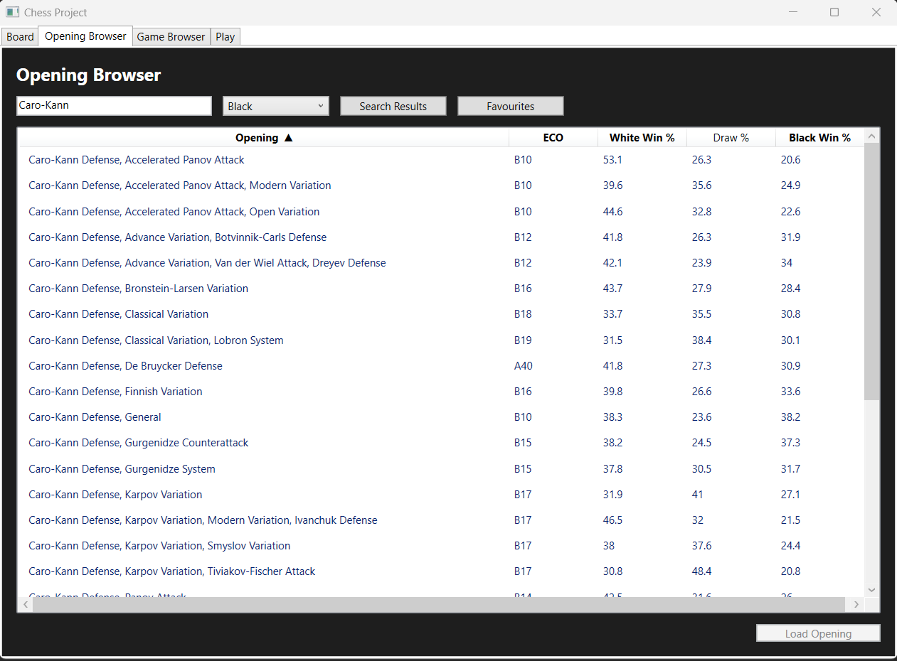
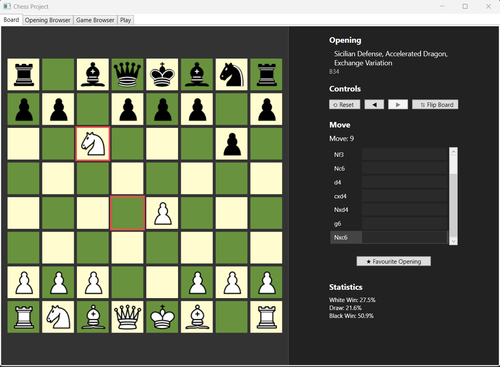
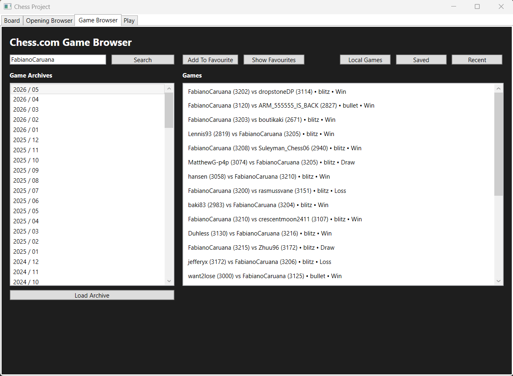
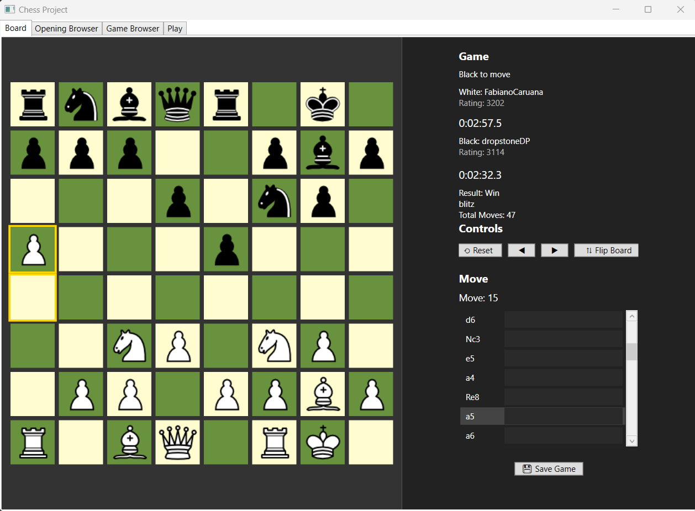
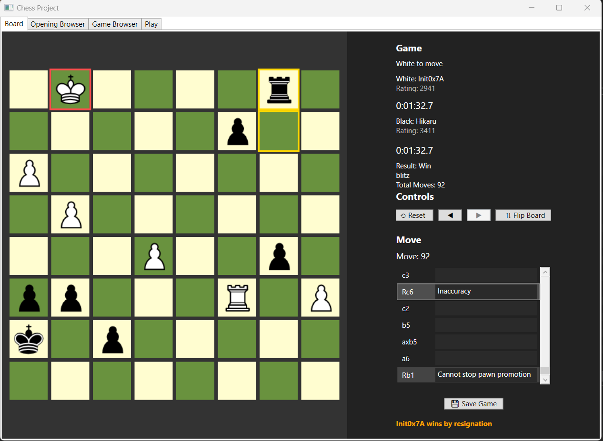
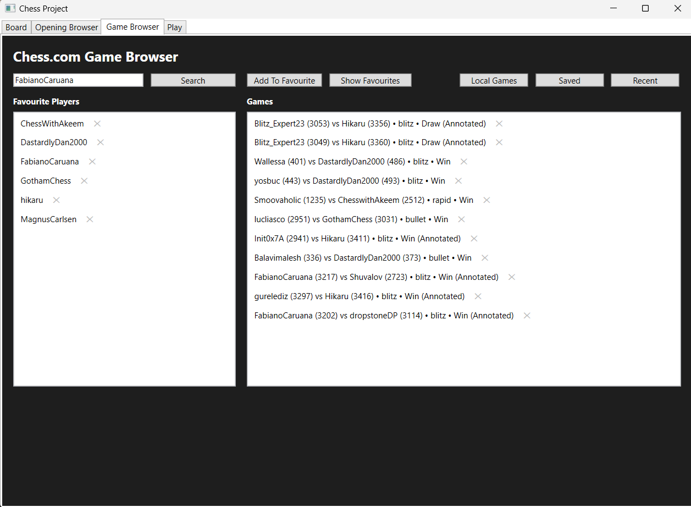
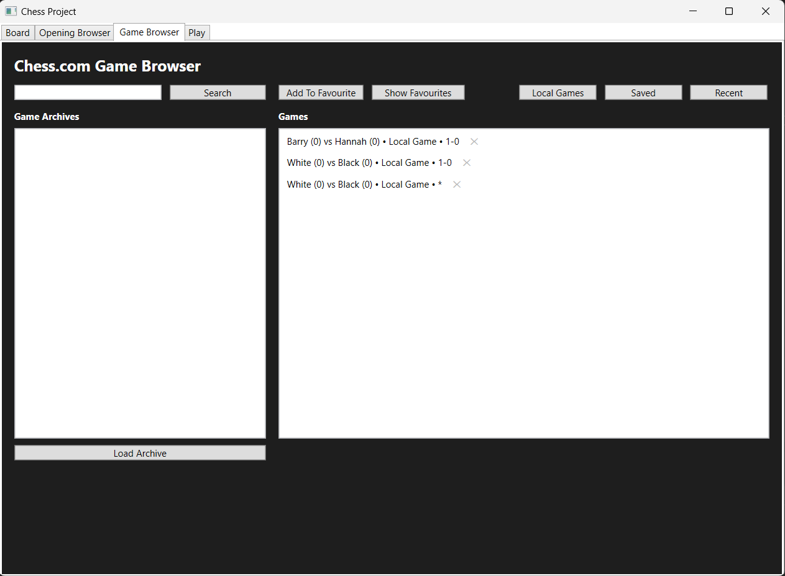
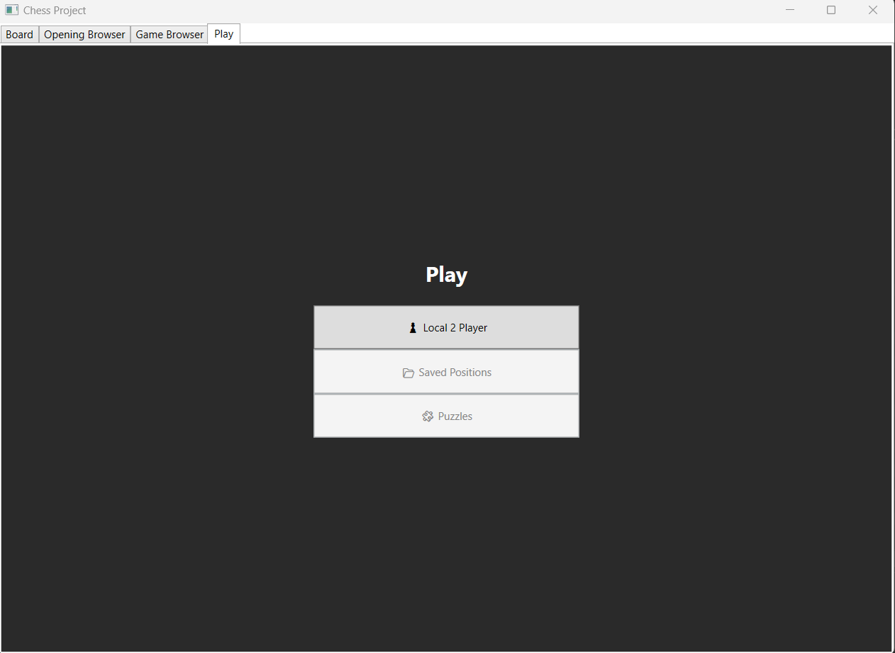
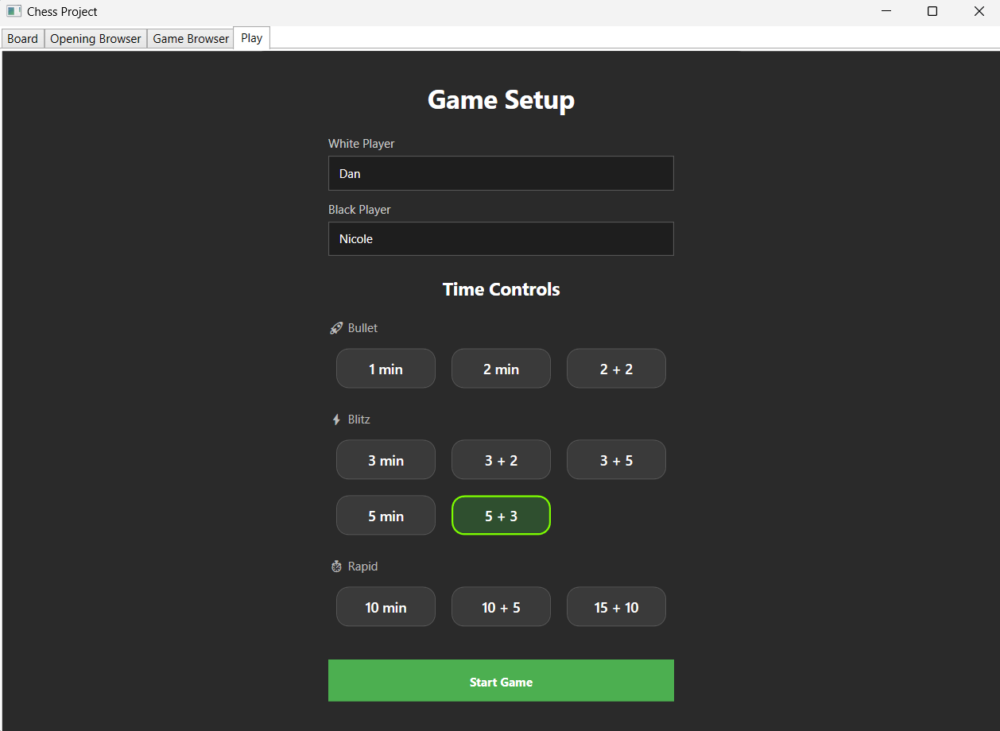
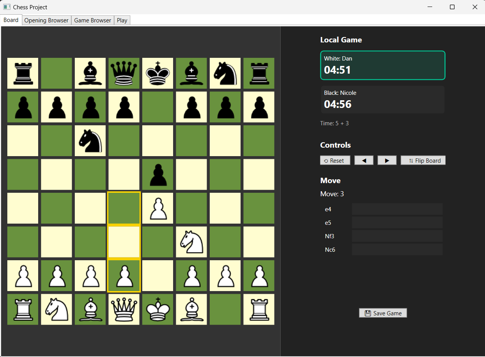

# ChessPrep

ChessPrep is a desktop chess analysis and replay platform built using **C#, WPF, and the MVVM architectural pattern**.

The application allows users to browse chess openings, replay games move-by-move, analyse positions, explore Chess.com archives, save favourite games, and play local two-player matches with configurable time controls.

A custom chess replay engine was implemented to reconstruct board states directly from SAN (Standard Algebraic Notation) move data, including movement validation and capture logic for all major chess pieces.

The project was designed to demonstrate:

* MVVM architecture
* command binding
* state-driven UI updates
* chess notation parsing
* replay engine design
* desktop application development using WPF

---

# Features

* Chess opening browser with search and filtering
* ECO classification support
* Opening statistics display
* Move-by-move opening replay
* SAN move parsing and board reconstruction
* Board orientation flipping
* Last move highlighting
* Chess.com archive browser
* Saved local games
* Favourite players system
* Favourite openings system
* Move annotation system
* Local two-player gameplay
* Configurable chess time controls
* Replay navigation controls
* MVVM architecture using commands and bindings

---

# Technologies

### Frontend / Desktop UI

* C#
* WPF
* XAML

### Architecture

* MVVM (Model-View-ViewModel)
* ICommand command binding
* ObservableCollection
* Data binding
* Value converters

### Data

* JSON opening datasets
* SAN chess notation
* Local saved game storage

### APIs / Libraries

* Chess.com Public API

---

# Application Overview

ChessPrep combines multiple chess-focused systems into a single desktop application:

* Opening preparation and exploration
* Chess replay and board reconstruction
* Chess.com archive browsing
* Local gameplay
* Saved game management
* Move annotation and analysis

The application dynamically reconstructs board positions from SAN notation by applying piece-specific movement logic and validating legal movement patterns across the board state.

---

# Opening Browser

The opening browser allows users to search and filter thousands of chess openings by:

* opening name
* ECO code
* colour preference
* win statistics

## Opening Search & Filtering

---

# Opening Replay System

Users can load openings directly onto the board and replay moves step-by-step.

Features include:

* move navigation
* board flipping
* move highlighting
* opening statistics display
* SAN move reconstruction

## Opening Replay

---

# Chess.com Game Browser

The application integrates with Chess.com archives to browse historical player games.

Users can:

* search for players
* browse archives
* replay games
* save favourites
* access recently viewed games

## Game Browser

---

# Game Replay System

Games can be replayed move-by-move using the custom replay engine.

The replay system reconstructs board state entirely from SAN move notation.

Features include:

* move navigation
* capture highlighting
* board orientation flipping
* move history tracking
* replay controls

## Game Replay

---

# Move Annotation System

Users can create annotations linked to specific moves during replay analysis.

## Move Annotations

---

# Saved Games & Favourite Players

The application supports:

* favourite player tracking
* saved local games
* recently viewed games

## Favourite Players & Saved Games

---

# Local Game Browser

Locally played games can be saved and replayed inside the application.

## Local Games

---

# Play Menu

The application includes a dedicated play interface for local two-player games.

## Play Menu

---

# Game Setup

Players can configure:

* player names
* chess clock settings
* increment formats
* blitz / rapid / bullet presets

## Game Setup

---

# Local Gameplay

The local gameplay system supports:

* interactive piece movement
* legal move validation
* valid move highlighting
* chess clock timers
* move history tracking
* board orientation flipping
* local game saving

## Local Match

---

# Technical Challenges

One of the most technically challenging aspects of the project was implementing the custom chess replay engine.

The engine reconstructs board state dynamically from SAN notation by:

* identifying piece types
* determining target squares
* validating movement rules
* checking movement paths
* applying captures
* rebuilding positions incrementally

Custom logic was implemented for:

* pawn movement and captures
* knight movement validation
* bishop diagonal path checking
* rook straight-line path checking
* queen combined movement logic
* king movement validation

The project also required careful synchronisation between:

* replay state
* UI bindings
* command execution
* move highlighting
* board orientation updates

---

# MVVM Architecture

The project was structured using the MVVM architectural pattern.

Key MVVM concepts implemented include:

* ViewModels
* RelayCommand command system
* property change notification
* ObservableCollection binding
* value converters
* event-driven communication between ViewModels

This architecture separates:

* UI presentation
* application logic
* data management

resulting in cleaner, more maintainable code.

---

# Project Structure

Core systems include:

* Replay Engine
* Opening Browser
* Chess.com Archive Browser
* Local Gameplay System
* Move Annotation System
* Saved Games System
* MVVM Command Infrastructure
* Board Reconstruction Logic

---

# Dataset

The opening database was built using a chess opening dataset originally provided in CSV format and converted into JSON for application usage.

The dataset includes:

* opening names
* ECO classifications
* move sequences
* win statistics

---

# Purpose

This project was developed to demonstrate:

* Desktop application development with WPF
* MVVM architecture
* Command binding
* State-driven UI design
* Chess notation parsing
* Replay engine development
* Collection binding and UI synchronisation
* Event-driven programming
* Local data persistence
* Complex application logic in C#

---

# Author

Daniel McNamee
Software Development Student
Atlantic Technological University (ATU) Sligo

GitHub
[https://github.com/daniel-mcnamee-dev](https://github.com/daniel-mcnamee-dev)
